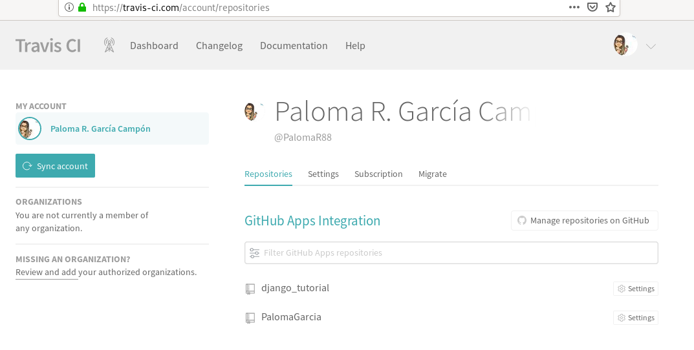
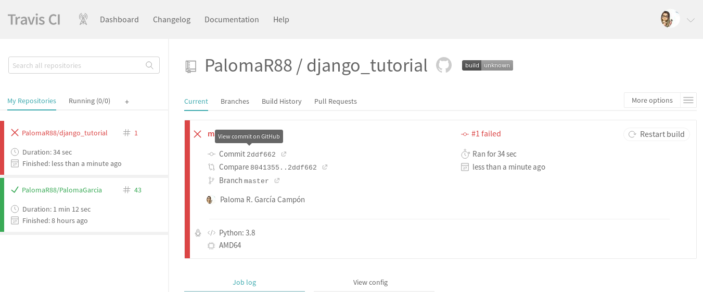
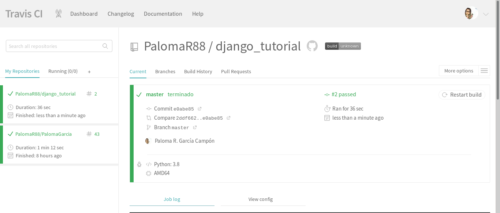

# Introducción a la integración continua
Para realizar la tareas podemos escoger el sistema de integración continúa que queramos: travis, gitlab, github actions, …

### Tarea 1: Despliegue de una página web estática (build, deploy)
En esta práctica investiga como generar una página web estática con la herramienta que elegiste en la práctica 1 de la asignatura y desplegarla en el servicio que utilizaste en esa práctica.
- En el repositorio GitHub sólo tienen que estar los ficheros markdown.
- La página se debe generar en el sistema de integración continúa, por lo tanto debemos instalar las herramientas necesarias.
- Investiga si podemos desplegar de forma automática en el servicio elegido (si es necesario cambia el servicio de hosting para el despliegue).

Para el despliegue de la página estática se ha utilizado Jekyll y GitHub-Pages. A coninuación se va a implementar travis. Para ello, se crear un nuevo repositorio en GitHub con todos los ficheros de configuración de Jekyll, en él, se crea una rama para alojar los html.

En este repositorio además se añade un fichero de configuración, **.travis.yml** con el siguiente contenido:
~~~
language: ruby
rvm:
  - 2.5.5

before_install:
#  - gem update --system
  - gem install bundler
  -
script:
  - bundle install
  - bundle exec jekyll build

branches:
  only:
  - master				

env:
  global:
  - NOKOGIRI_USE_SYSTEM_LIBRARIES=true	
sudo: false				

addons:
  apt:
    packages:
    - libcurl4-openssl-dev

cache: bundler

notifications:				
  email: false				

deploy:					
  provider: pages			
  skip_cleanup: true			
  local_dir: _site		
  github_token: $github_token
  on:					
    repo: PalomaR88/palomar88.github.io
    on:					
      branch: master			
  fqdn: palomar88.github.io
~~~

En travis-ci.com se seleccionan los repositorios que queramos que se utilicen, en nuestro caso solo un.
[imagen](imagen/aimg.png)

En el repositorio hay que crear el token en la siguiente ventana en el apartado setting:
[imagen](imagen/bimg.png)

Con las siguientes opciones:
[imagen](imagen/cimg.png)

Y en travis se introduce la clave del token que se ha creado:
[imagen](imagen/dimg.png)

[Pincha aquí para ver la página creada](https://palomar88.github.io/)

### Tarea 2: Integración continúa de aplicación django (Test + Deploy)
Vamos a trabajar con el repositorio de la aplicación [django_tutorial](https://github.com/josedom24/django_tutorial). Esta aplicación tiene definidas una serie de test, que podemos estudiar en el fichero tests.py del directorio polls.

Para ejecutar las pruebas unitarias, ejecutamos la instrucción python3 manage.py test.

Estudia las distintas pruebas que se han realizado, y modifica el código de la aplicación para que al menos una de ella no se ejecute de manera exitosa.

A continuación vamos a configurar la integración continúa para que cada vez que hagamos un commit se haga la ejecución de test en travis.

Crea un fichero .travis.yml para realizar de los tests en travis. Entrega el fichero .travis.yml, una captura de pantalla con un resltado exitoso de la IC y otro con un error.

Siguiendo la guía de esta página: Continuous delivery of a Django app from Travis CI to PythonAnywhere. Para además de realizar los tests, se haga un despliegue al servicio pythonanyhere.

Entrega un breve descripción de los pasos más importantes para realizar el despliegue desde travis.

Se clona el repositorio:
~~~
paloma@coatlicue:~/DISCO2/CICLO II/IMPLANTACIÓN DE APLICACIONES WEB/Integracion_continua$ git clone https://github.com/josedom24/django_tutorial.git
~~~

Se crea un entorno virtual:
~~~
paloma@coatlicue:~/DISCO2/CICLO II/IMPLANTACIÓN DE APLICACIONES WEB/Integracion_continua/django_tutorial$ python3 -m venv entorno_django
paloma@coatlicue:~/DISCO2/CICLO II/IMPLANTACIÓN DE APLICACIONES WEB/Integracion_continua/django_tutorial$ source entorno_django/bin/activate
(entorno_django) paloma@coatlicue:~/DISCO2/CICLO II/IMPLANTACIÓN DE APLICACIONES WEB/Integracion_continua/django_tutorial$ 
~~~

Y se instalan los repositorios de django_tutorial/requirements.txt
~~~
(entorno_django) paloma@coatlicue:~/DISCO2/CICLO II/IMPLANTACIÓN DE APLICA
CIONES WEB/Integracion_continua/django_tutorial/django_tutorial$ pip install -r requirements.txt 
Collecting Django==2.2.7 (from -r requirements.txt (line 1))
  Using cached https://files.pythonhosted.org/packages/a0/36/463632a2e9161a7e713488d719a280e8cb0c7e3a66ed32a32e801891caae/Django-2.2.7-py3-none-any.whl
Collecting gunicorn (from -r requirements.txt (line 2))
  Downloading https://files.pythonhosted.org/packages/69/ca/926f7cd3a2014b16870086b2d0fdc84a9e49473c68a8dff8b57f7c156f43/gunicorn-20.0.4-py2.py3-none-any.whl (77kB)
    100% |████████████████████████████████| 81kB 451kB/s 
Collecting pytz (from Django==2.2.7->-r requirements.txt (line 1))
  Using cached https://files.pythonhosted.org/packages/e7/f9/f0b53f88060247251bf481fa6ea62cd0d25bf1b11a87888e53ce5b7c8ad2/pytz-2019.3-py2.py3-none-any.whl
Collecting sqlparse (from Django==2.2.7->-r requirements.txt (line 1))
  Using cached https://files.pythonhosted.org/packages/ef/53/900f7d2a54557c6a37886585a91336520e5539e3ae2423ff1102daf4f3a7/sqlparse-0.3.0-py2.py3-none-any.whl
Requirement already satisfied: setuptools>=3.0 in /home/paloma/DISCO2/CICLO II/IMPLANTACIÓN DE APLICACIONES WEB/Integracion_continua/django_tutorial/entorno_django/lib/python3.7/site-packages (from gunicorn->-r requirements.txt (line 2)) (40.8.0)
Installing collected packages: pytz, sqlparse, Django, gunicorn
Successfully installed Django-2.2.7 gunicorn-20.0.4 pytz-2019.3 sqlparse-0.3.0
~~~

Se realizan los test:
~~~
(entorno_django) paloma@coatlicue:~/DISCO2/CICLO II/IMPLANTACIÓN DE APLICACIONES WEB/Integracion_continua/django_tutorial/django_tutorial$ python3 manage.py test
Creating test database for alias 'default'...
System check identified no issues (0 silenced).
..........
----------------------------------------------------------------------
Ran 10 tests in 0.058s

OK
Destroying test database for alias 'default'...
~~~

El resultado de los test es correcta. A continuación se modifica la aplicación para que aparezca algún error en los test:
~~~
(ent_django) paloma@coatlicue:~/django_tutorial$ python3 manage.py test
Creating test database for alias 'default'...
System check identified no issues (0 silenced).
..F.F.....
======================================================================
FAIL: test_future_question (polls.tests.QuestionIndexViewTests)
----------------------------------------------------------------------
Traceback (most recent call last):
  File "/home/paloma/django_tutorial/polls/tests.py", line 79, in test_future_question
    self.assertContains(response, "No polls are available.")
  File "/home/paloma/ent_django/lib/python3.7/site-packages/django/test/testcases.py", line 454, in assertContains
    self.assertTrue(real_count != 0, msg_prefix + "Couldn't find %s in response" % text_repr)
AssertionError: False is not true : Couldn't find 'No polls are available.' in response

======================================================================
FAIL: test_no_questions (polls.tests.QuestionIndexViewTests)
----------------------------------------------------------------------
Traceback (most recent call last):
  File "/home/paloma/django_tutorial/polls/tests.py", line 57, in test_no_questions
    self.assertContains(response, "No polls are available.")
  File "/home/paloma/ent_django/lib/python3.7/site-packages/django/test/testcases.py", line 454, in assertContains
    self.assertTrue(real_count != 0, msg_prefix + "Couldn't find %s in response" % text_repr)
AssertionError: False is not true : Couldn't find 'No polls are available.' in response

----------------------------------------------------------------------
Ran 10 tests in 0.055s

FAILED (failures=2)
Destroying test database for alias 'default'...
~~~

El error indica que la respuesta debía ser "No polls are available." y, anteriormente, se ha cambiado. 

Se realiza un fork que es [el siguiente](https://github.com/PalomaR88/django_tutorial). Después, se clona para añadir el fichero **.travis.yml**:
~~~
(ent_django) paloma@coatlicue:~$ git clone git@github.com:PalomaR88/django_tutorial.git
Clonando en 'django_tutorial'...
remote: Enumerating objects: 3, done.
remote: Counting objects: 100% (3/3), done.
remote: Compressing objects: 100% (2/2), done.
remote: Total 96 (delta 0), reused 0 (delta 0), pack-reused 93
Recibiendo objetos: 100% (96/96), 291.44 KiB | 700.00 KiB/s, listo.
Resolviendo deltas: 100% (25/25), listo.
(ent_django) paloma@coatlicue:~$ cd django_tutorial/
(ent_django) paloma@coatlicue:~/django_tutorial$ touch .travis.yml
~~~

Contenido del fichero .travis.yml:
~~~
language: python
python:
  - "3.8"
install:
  - pip3 install -r requirements.txt
script: python3 manage.py test
~~~

Tras añadir el nuevo fichero al repositorio se añade el repositorio en travis:

Se modifica lo mismo que se modificó anteriormente para ver que pasa en travis, y se observa que aparece un error:

Y se vuelve atrás para que aparezca correctamente:

